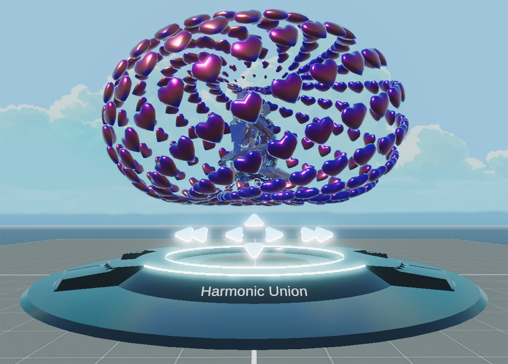

# GLB Explorer

A scene with an interactive 3D NFT explorer in Decentraland.



This scene shows you:

- How to switch 3D models via an interactive interface
- Use OpenNFTDialog to reference / update NFT metadata
- How to handle changes through a system
- How to create custom components

## Try it out

**Install the CLI**

Download and install the Decentraland CLI by running the following command:

```bash
npm i -g decentraland
```

**Previewing the scene**

Download this example and navigate to its directory, then run:

```
$:  dcl start
```

Any dependencies are installed and then the CLI opens the scene in a new browser tab.

Learn more about how to build your own scenes in our documentation site.

If something doesn’t work, please file an issue.
